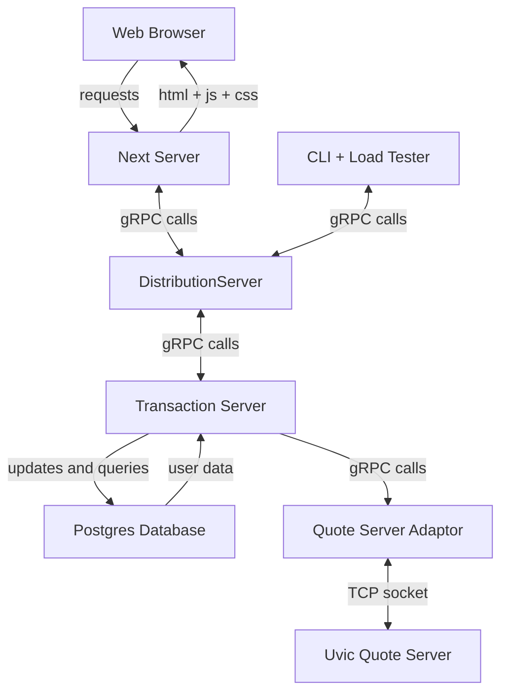

# Day-Trader 
[](https://github.com/MarcusDunn/day-trader/actions/workflows/quote-server-adaptor.yml)[](https://github.com/MarcusDunn/day-trader/actions/workflows/cli.yml)

This is an implementation of a scalable day trading application for UVic's Scalable Systems offering (SENG 468).

## Running

`docker compose up` will get the server running. It expects your computer has 16GB of ram and allocates memory between containers accordingly.

### CLI

There are downloadable binaries for the CLI on the releases pages. `cli --help` will display available commands.

### GUI

`cd frontend`

`npm run dev`

The where the frontend is running should be displayed in the terminal.

## Architecture



## Database Schema

```mermaid
erDiagram
    trader {
        double balance
        user_id text
    }
    stock {
        text owner_id 
        text stock_symbol 
        double amount
    }
    trader ||--|{ stock : owns
    sell_trigger {
        text owner_id
        text stock_symbol
        amount_stock double
        trigger_price double
    }
    trader ||--|{ sell_trigger : has
    buy_trigger {
        text owner_id
        text stock_symbol
        amount_dollars double
        trigger_price double
    }
    trader ||--|{ buy_trigger : has
    queued_sell {
        text owner_id
        text stock_symbol
        double amount_dollars
        double quoted_price
        timestamp time_created
    }
    trader ||--|| queued_sell : has
    queued_buy {
        text owner_id
        text stock_symbol
        double amount_dollars
        double quoted_price
        timestamp time_created
    }
    trader ||--|| queued_buy : has
    log_entry {
        timestamp timestamp
        text server
        int transaction_num
        text username
        jsonb log 
    }
 ```

## Performance
With an AMD Ryzen 9 3900X with 32GB of ram running `docker compose -f v2.docker-compose.yml up` and then running the CLI on the largest load test file one can get thier hands on it pushes past 20 000 requests per second without fully loading the CPU!

### A Sample of Requests as Shown by Jaeger


### A Set of Spans for a Single Request


### Output of `docker container stats` mid loadtest


### Output of `htop` mid loadtest


## Sample Logs
```xml
  <UserCommandType>
    <timestamp>1680507440</timestamp>
    <server>legacy</server>
    <transaction_num>1195350</transaction_num>
    <command>SET_SELL_AMOUNT</command>
    <username>CYIrN6qO2N</username>
    <stock_symbol>IDI</stock_symbol>
    <funds>496.6</funds>
  </UserCommandType>
  <ErrorEventType>
    <timestamp>1680507440</timestamp>
    <server>legacy</server>
    <transaction_num>0</transaction_num>
    <command>SET_BUY_TRIGGER</command>
    <username>1wyTlMDn10</username>
    <stock_symbol>TRL</stock_symbol>
    <funds>176.29</funds>
    <error_message>No buy trigger set</error_message>
  </ErrorEventType>
  <UserCommandType>
    <timestamp>1680507440</timestamp>
    <server>legacy</server>
    <transaction_num>1172087</transaction_num>
    <command>SET_BUY_AMOUNT</command>
    <username>lC16pAjgWv</username>
    <stock_symbol>WOA</stock_symbol>
    <funds>273.14</funds>
  </UserCommandType>
```
