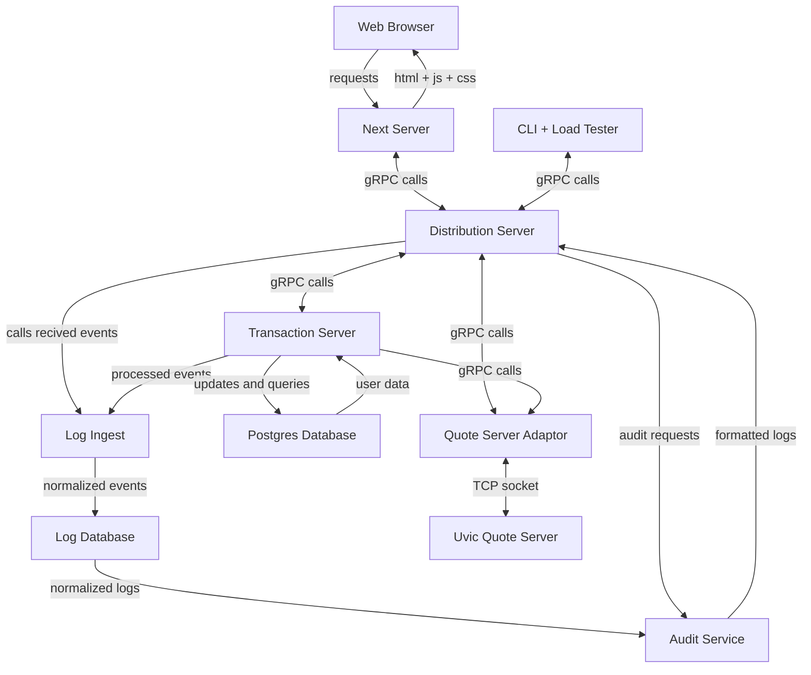

# Day-Trader 
[](https://github.com/MarcusDunn/day-trader/actions/workflows/quote-server-adaptor.yml)[](https://github.com/MarcusDunn/day-trader/actions/workflows/cli.yml)

This is an implementation of a scalable day trading application for UVic's Scalable Systems offering (SENG 468).

## Architecture



## Database Schema

```mermaid
erDiagram
    USER {
        string balance
    }
    USER ||--|{ BUY_TRIGGER : has
    BUY_TRIGGER {
        string ticker
        number trigger_point
    }
    USER ||--|{ SELL_TRIGGER : has
    SELL_TRIGGER {
        string ticker
        number trigger_point
    }
    USER ||--|{ OWNED_STOCK : has
    OWNED_STOCK {
        string ticker
        number amount
    }
 ```
