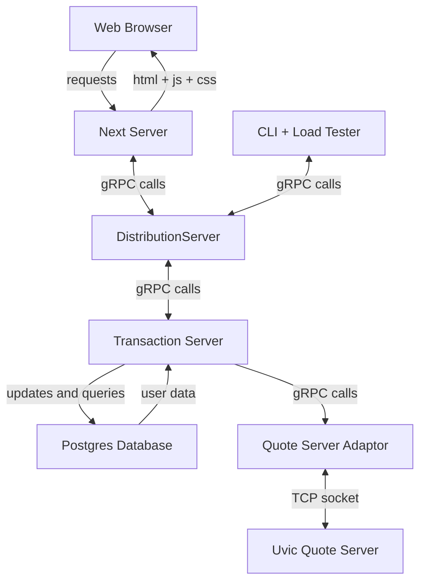

# Day-Trader 
[](https://github.com/MarcusDunn/day-trader/actions/workflows/quote-server-adaptor.yml)[](https://github.com/MarcusDunn/day-trader/actions/workflows/cli.yml)

This is an implementation of a scalable day trading application for UVic's Scalable Systems offering (SENG 468).

With an AMD Ryzen 9 3900X with 32GB of ram running `docker compose -f v2.docker-compose.yml up` and then running the CLI on the largest load test file one can get thier hands on it pushes past 20 000 requests per second without fully loading the CPU!


## Architecture



## Database Schema

```mermaid
erDiagram
    trader {
        double balance
        user_id text
    }
    stock {
        text owner_id 
        text stock_symbol 
        double amount
    }
    trader ||--|{ stock : owns
    sell_trigger {
        text owner_id
        text stock_symbol
        amount_stock double
        trigger_price double
    }
    trader ||--|{ sell_trigger : has
    buy_trigger {
        text owner_id
        text stock_symbol
        amount_dollars double
        trigger_price double
    }
    trader ||--|{ buy_trigger : has
    queued_sell {
        text owner_id
        text stock_symbol
        double amount_dollars
        double quoted_price
        timestamp time_created
    }
    trader ||--|| queued_sell : has
    queued_buy {
        text owner_id
        text stock_symbol
        double amount_dollars
        double quoted_price
        timestamp time_created
    }
    trader ||--|| queued_buy : has
    log_entry {
        timestamp timestamp
        text server
        int transaction_num
        text username
        jsonb log 
    }
 ```
