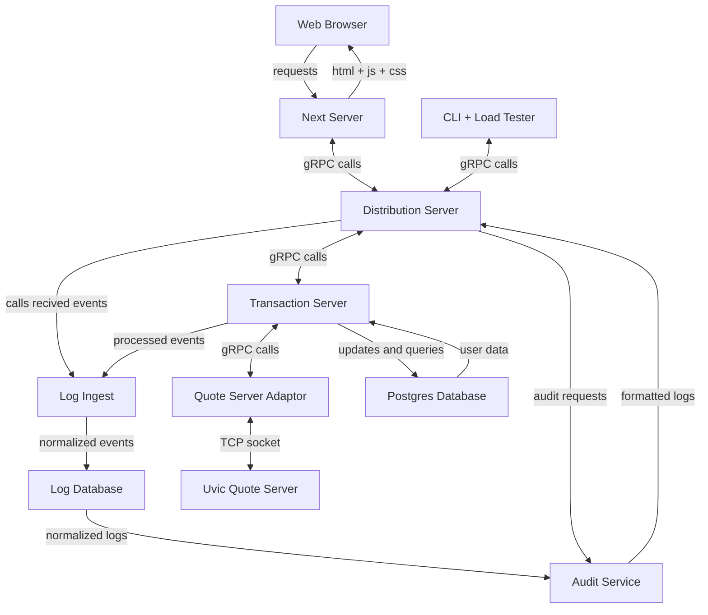

# Day-Trader 

This is an implementation of a scalable day trading application for UVic's Scalable Systems offering (SENG 468).

```mermaid
graph TD
    A[Web Browser] -->|requests| B
    B -->|html + js + css| A
    B[Next Server] <-->|gRPC calls| C
    L[CLI + Load Tester] <--> |gRPC calls| C
    C[Distribution Server] <--> |gRPC calls| D
    C --> |calls recived events| E
    LogDB[Log Database] -->|normalized logs| F
    E[Log Ingest] --> |normalized events| LogDB
    F[Audit Service] -->|formatted logs| C
    C --> |audit requests| F
    D[Transaction Server] <-->|gRPC calls| QSA
    D --> |processed events| E
    DB[Postgres Database] --> |user data| D
    D --> |updates and queries| DB
    UQS[Uvic Quote Server]
    QSA[Quote Server Adaptor] <-->|TCP socket| UQS
```
